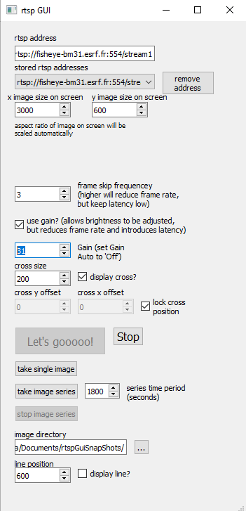

A gui for running an rtsp stream, with cross and line overlay for aligning samples in a microscope, for example. Based on my Lucid camera gui.

Requires PyQt5, numpy and opencv-python. May also require FFPlay/FFMpeg installed https://ffmpeg.org/download.html

Can be installed with 'pip install -e .', this should create an executable connected to the rtspStreamGui.py main() function in the 'Scripts' folder.

